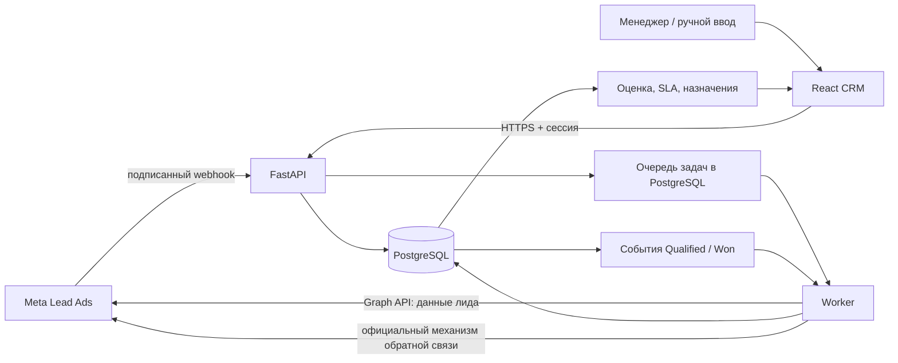
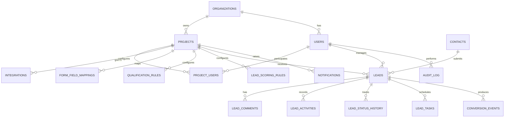

# Архитектура ADS.KZ CRM

## 1. Задача и границы

Система обслуживает организацию ADS.KZ и несколько изолированных проектов клиентов. Для каждого проекта отдельно задаются менеджеры, формы, интеграции, правила оценки, минимальный рекламный бюджет и SLA. Первый рабочий источник — Meta Lead Ads; второй — ручной ввод. Остальные источники получают общий контракт и место для расширения, без имитации их API.

Бизнес цепочка: рекламная форма → достоверная запись лида → быстрый контакт → подтверждённая квалификация → продажа → аналитика → событие обратной связи в Meta. CRM не может гарантировать отсутствие мусорных заявок: она снижает их долю вопросами формы, выделяет сомнительные лиды, сохраняет причины и позволяет улучшать кампании по фактическим продажам.

## 2. Технологии и компоненты

| Компонент | Выбор | Назначение |
| --- | --- | --- |
| Web | React + TypeScript | Адаптивная CRM: список, канбан, карточка, задачи, отчёты, настройки |
| API | Python + FastAPI + Pydantic | Авторизация, операции CRM, вебхуки, OpenAPI |
| Данные | PostgreSQL + SQLAlchemy + Alembic | Транзакции, ограничения, индексы, миграции |
| Фоновые операции | Отдельный Python worker + таблица задач в PostgreSQL | Получение данных Meta и повторная отправка событий без обязательного Redis |
| Запуск | Docker Compose | API, web, worker, PostgreSQL; HTTPS через внешний reverse proxy |

Разделить backend на `auth`, `organizations`, `projects`, `integrations`, `lead_sources`, `leads`, `qualification`, `tasks`, `analytics`, `conversion_feedback`, `audit`. Внутри модулей отделять HTTP, бизнес логику и хранение данных. Внешние вызовы Meta не выполнять в транзакции обработки HTTP вебхука.



## 3. Схема данных

Каждая бизнес запись содержит `organization_id` напрямую или через обязательный `project_id`. Доступ к строке всегда ограничивается организацией и правами пользователя. Проектная изоляция обеспечивается в сервисах и проверяется тестами.



### Основные таблицы и ограничения

| Таблица | Основные поля и ограничения |
| --- | --- |
| `organizations` | `id`, `name`, timestamps |
| `users` | `id`, `organization_id`, globally unique internal `username`, `password_hash`, `role` (`ADMIN`, `MANAGER`), `active`; локальный вход администратора в UI требует только пароль |
| `projects` | `id`, `organization_id`, `name`, `minimum_ad_budget`, `currency`, `sla_json`, `assignment_mode`, `priority_thresholds_json`, timestamps |
| `project_users` | unique (`project_id`, `user_id`), `active`, assignment order |
| `integrations` | `id`, `project_id`, `provider`, `name`, `credentials_encrypted`, `config_json`, `active`; Meta config binds allowed page/form IDs to a project |
| `contacts` | `id`, `organization_id`, normalized phone/email; a contact may have many leads, ambiguous matches require review |
| `leads` | `id`, `project_id`, `contact_id`, `source`, external IDs for lead/form/campaign/adset/ad/page/account, `name`, `phone`, `email`, `company_name`, `city`, `region`, `business_niche`, `monthly_ad_budget`, `client_goal`, `requested_service`, `advertising_status`, `launch_timeline`, `status`, `contact_result`, manager ID, timestamps of first contact/WhatsApp/qualified/won/lost, response seconds, score, priority, low budget flag, sale value/currency, raw payload and provider metadata |
| `lead_comments`, `lead_activities`, `lead_status_history` | `lead_id`, actor, timestamp; structured change details and prior/new status |
| `lead_tasks` | `lead_id`, manager, due time, type, state, completion time |
| `form_field_mappings` | unique (`project_id`, `integration_id`, `external_form_id`, `external_field_key`); target canonical field; version and active flag |
| `qualification_rules`, `lead_scoring_rules` | `project_id`, typed condition, value/weight, active, priority, version |
| `conversion_events` | `project_id`, `lead_id`, provider, stable `event_id` unique, event name/type/time, status, retry count, next attempt, HTTP status, safe response/error summary |
| `notifications` | recipient, project, lead/task reference, type, read timestamp |
| `audit_log` | organization, project, actor, entity, action, before/after safe fields, timestamp |
| `webhook_deliveries` | provider, payload digest, received time, processing state, safe error summary; supports audit and replay |

Unique partial index on (`project_id`, `source`, `external_lead_id`) where external ID exists blocks duplicate imports. Separate indexes support project/date, project/status, manager/status, phone/email, campaign/ad/adset/form, city, budget, qualified/won times. Personal data and raw payload receive a retention policy and restricted access.

Do not auto merge leads by phone/email. Show possible duplicates and link a `contact` only after safe matching or manager confirmation. Multiple leads may legitimately belong to the same person.

## 4. Data flow and reliability

1. Meta sends a verification request to `GET /webhooks/meta`; the API checks the configured verify token and returns the challenge. Production event deliveries to `POST /webhooks/meta` are checked against the raw request body using the app secret before parsing.
2. The receiver identifies the allowed project by page/form/integration mapping, stores the delivery and a fetch job, then acknowledges promptly. Unknown mappings are kept for investigation, not silently assigned to another project.
3. Worker retrieves complete lead data using the versioned official Graph API, normalizes form answers through `FormFieldMapping`, keeps the original payload, and inserts the lead once. A repeated delivery is harmless.
4. On insert, project rules calculate score and priority, detect possible duplicates, assign a manager when enabled, open the initial SLA timer, and add an activity/notification.
5. Manager opens WhatsApp via `POST /leads/{id}/whatsapp-click`; the click time is recorded as an interaction proxy. A click does **not** prove that a message was sent or read. Explicit contact result and status are recorded separately.
6. Qualification and sale are confirmed by a user with access. Status, timestamps, history, activity, audit entry and outbound event are committed together. Worker sends the event later, with stable ID and retry schedule of 1, 5, 15 and 60 minutes. Permanent errors are visible to admin.
7. Analytics use current lead state plus immutable status history. Campaign reports join external IDs and imported spend when available. CPL and cost per qualified lead remain unavailable until real spend data is supplied; they are never invented.

## 5. Source and feedback contracts

```text
LeadSourceAdapter
  verify_webhook(raw_body, headers, query)
  parse_webhook(raw_body) -> provider references
  fetch_lead_details(reference, credentials) -> provider payload
  normalize_lead(payload, field_mapping) -> canonical lead
  test_connection(credentials, config) -> result

ConversionFeedbackAdapter
  send_qualified_lead(event, integration) -> delivery result
  send_sale(event, integration) -> delivery result
  send_custom_conversion(event, integration) -> delivery result
```

`MetaLeadSourceAdapter` and `ManualLeadSourceAdapter` are the first concrete source adapters. Manual data is authenticated API input with no external webhook. Meta feedback is a separate adapter. LinkedIn, TikTok, Google, Website and messaging sources have provider identifiers and contracts; their API implementations require their own documented integration work.

Before coding Meta, verify current official documentation, available app permissions, lead access, Graph API version, webhook subscription, test lead flow and the supported CRM conversion mechanism. Pin the version in configuration and record it in integration metadata. Never expose app secret or access token to the browser.

## 6. Lead form and qualification

ADS.KZ's proposed form captures niche, goal, current advertising, monthly **advertising** budget, launch timeline, name, phone, email, company and city. `requested_service` distinguishes targeting, CRM and API work. Required fields should be limited to those needed to contact and qualify; explicit price or budget questions help reduce unsuitable applications. Consent and privacy notice are part of the published form.

Budget ranges map to a structured bracket and a numeric lower bound; ranges are not misrepresented as exact spending. ADS.KZ's initial scoring rules:

| Dimension | Choice → points |
| --- | --- |
| Monthly ad budget | `<150k` → 0; `150–300k` → 15; `300–500k` → 25; `500k–1m` → 35; `>1m` → 40 |
| Launch timing | ASAP → 20; 1–2 weeks → 15; within month → 10; exploring → 3 |
| Advertising status | active → 10; previously active → 7; never → 4 |
| Goal | quality leads → 15; sales → 15; full system → 20; CRM/analytics → 15 |

Score is clamped to 0–100. Admin can change weights and thresholds per project. Default priority: HOT ≥70, WARM 40–69, COLD <40. For targeting requests with ad budget below the project minimum of 150,000 ₸, add `LOW_BUDGET`, cap priority below HOT and suggest `UNQUALIFIED` for manager review. Do not auto delete or conclusively disqualify the lead. For CRM/API only requests, the ad budget floor does not determine suitability; qualification is based on the actual service need. This service specific rule prevents rejecting legitimate CRM/API prospects.

`QUALIFIED` requires an explicit manager decision; rules provide suggestions. `WON` requires a sale value and currency. Each transition validates role, records reason where applicable, and prevents duplicate conversion events.

## 7. Roles, API and security

`ADMIN` sees all permitted organization projects and configures users, integrations, rules, scoring, SLA and reports. `MANAGER` sees assigned project leads, updates permitted records and tasks. Every list, detail, export and action enforces the same organization/project scope on the server; hiding a button in React is insufficient.

REST API groups: `/auth`, `/projects`, `/users`, `/integrations`, `/leads`, `/tasks`, `/analytics`, `/conversion-events`, `/webhooks/meta`. Lead endpoints include list/create/detail/update, status, assignment, WhatsApp click, contact result, comments and tasks. Analytics include funnel, source/campaign/ad, managers, response time, budget, cities and loss reasons. OpenAPI is published via FastAPI with appropriate access controls in production.

Use strong password hashing, short lived authenticated sessions, role checks, input validation, CORS allowlist, rate limits on login/public endpoints, secure headers, parameterized SQL, audit logs and encryption at rest for integration credentials. CSV/XLSX exports use the same filters and permissions. Never log full access tokens, raw credentials or unnecessary personal data. Backups must be encrypted and restoration tested.

## 8. Quality reports and interpretation

- Qualified rate = qualified leads / all leads; sale rate = won / all leads; qualified to sale = won / qualified.
- Low budget rate = low budget leads / all leads, with separate breakdown by service. Reports group by source, campaign, ad set, ad, form, city and budget bracket.
- Response time is measured from lead creation to recorded first interaction; WhatsApp click is displayed separately from confirmed contact.
- Funnel stage history supports cohort and time to stage reports. Denominators, selected date and timezone are visible in the UI. Empty denominators show `—`.
- Lead and manager dashboards show new leads, overdue tasks/SLA, stage aging, contact outcomes and loss reasons. Recommended next actions are transparent project rules, not paid AI.

## 9. External sources checked for design

Meta's [Lead Generation Guide](https://about.fb.com/ltam/wp-content/uploads/sites/14/2023/11/LeadGenerationGuide.pdf) describes syncing leads to CRM and returning CRM quality signals. Meta's [official Lead Ads webhook sample](https://github.com/fbsamples/lead-ads-webhook-sample) demonstrates lead retrieval by lead ID. The developer documentation itself returned a rate limit during this architecture pass, so exact API permissions, endpoint version and conversion payload must be verified against [Meta for Developers](https://developers.facebook.com/docs/) immediately before implementation; no endpoint is assumed here.
